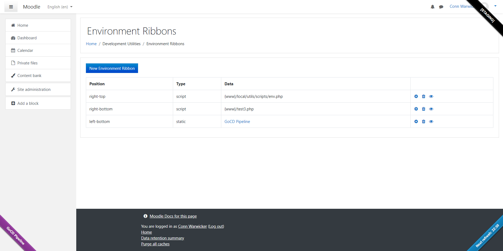

# Environment Ribbons

This plugin allows you to set ribbons in the 4 corners of your site, displaying either static text, or dynamic text driven from a script.

For example, you they could be used to display the environment type (production, staging, local, etc...), to display the git branch name of your repository, to display links to pipelines, or anything else you like.
Dynamic scripts will be loaded using `curl`, so as long as the URL can be loaded and returns some data, it should work.
 
A few script examples are included in the `/scripts/` directory.

## Installation
**From github:**
1. Download the latest version of the plugin from this repository.
2. Extract the directory from the zip file and rename it to 'ribbons' if it is not already named as such.
3. Place the 'ribbons' folder into your Moodle site's */admin/tool/* directory.
4. Run the Moodle upgrade process either through the web interface or command line.
5. Navigate to the Site Administration -> Plugins -> Admin Tools to find the Environment Ribbons configuration page(s).

## License
https://www.gnu.org/licenses/gpl-3.0

## Support
If you need any help using the block, or wish to report a bug or feature request, please use the issue tracking system: https://github.com/cwarwicker/moodle-tool_ribbons/issues